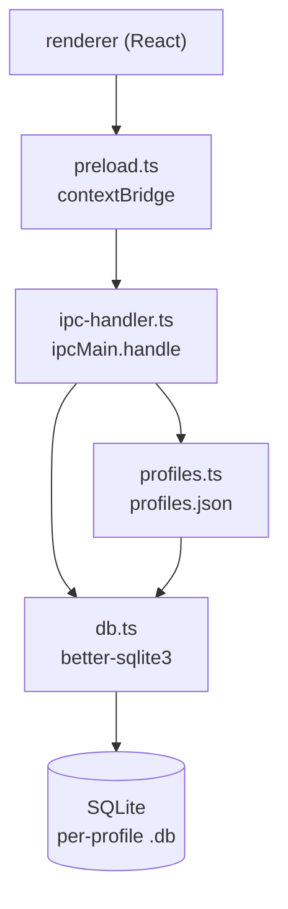
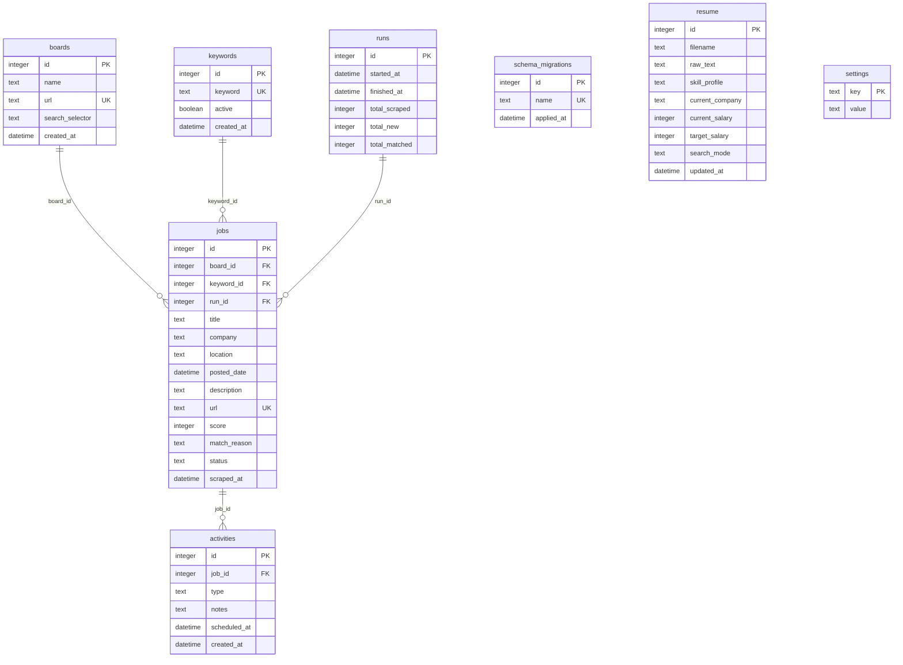

# Architecture — What "doing good work" means

> This document defines the quality bar. Reviewer agents evaluate code against
> this file. If it is not here, it is not a requirement.

## Principles

1. **Clear layers.** Define the module boundaries for this project here as
   features are added. Do not introduce extra layers (services, repositories,
   ORMs) until there is a concrete reason documented in `feature_list.json`.

2. **Minimal dependencies.** Prefer stdlib or well-justified deps. If a
   feature requires a new dependency, discuss first (status `blocked`).

3. **Explicit errors.** Functions that can fail throw named errors or return
   typed results — not silent `null`/`undefined` without documentation.

4. **Separation of concerns.** Keep I/O, domain logic, and UI/CLI boundaries
   separate. Do not mix persistence with presentation.

5. **Deterministic tests.** Tests use real temp directories or in-memory
   fixtures — not brittle mocks of the filesystem unless unavoidable.

## Module map (`src/main/`)

| Module | Responsibility |
|--------|----------------|
| `index.ts` | Electron app entry: window creation, startup hooks |
| `ipc-handler.ts` | Registers IPC channels; routes renderer requests to main-process logic |
| `preload.ts` | Exposes a typed, allowlisted `window.api` bridge via `contextBridge` |
| `db.ts` | Opens SQLite via `better-sqlite3`, runs versioned migrations, exports active `db` |
| `profiles.ts` | Multi-profile index (`profiles.json`), profile CRUD, switches active DB |
| `migrations/*.sql` | Versioned DDL applied in lexicographic order |

## Module map (`src/renderer/`)

| Module | Responsibility |
|--------|----------------|
| `main.tsx` | React entry point |
| `App.tsx` | Root component (screens added per feature) |
| `i18n.ts` | i18next setup |

## Data flow

Persistence uses **better-sqlite3** directly (no ORM). The main process owns
all database access; the renderer never touches the filesystem or SQLite.

## IPC channels

Channels exposed through `preload.ts` must appear in the allowlist. Implemented
handlers live in `ipc-handler.ts`.

| Channel | Direction | Handler | Status |
|---------|-----------|---------|--------|
| `db:query` | renderer → main | `runQuery(db, sql, params)` | implemented |
| `profiles:list` | renderer → main | `listProfiles()` | implemented |
| `profiles:create` | renderer → main | `createProfile(name)` | implemented |
| `profiles:switch` | renderer → main | `switchProfile(profileId)` | implemented |
| `profiles:delete` | renderer → main | `deleteProfile(profileId)` | implemented |
| `scraper:run` | renderer → main | `runScraper(payload)` — Playwright pipeline, `runs`/`jobs` persistence | implemented |
| `scraper:provideSelector` | renderer → main | `provideSelector(payload)` — resume paused board after `selector_required` | implemented |
| `scraper:progress` | main → renderer | `webContents.send` lifecycle events (`log`, `board_start`, `board_done`, `keyword_start`, `selector_required`, `run_complete`, `run_error`) | implemented |
| `ollama:list` | renderer → main | stub | pending |
| `fs:openPath` | renderer → main | stub | pending |
| `resume:upload` | renderer → main | `uploadResume()` — native file dialog, main-process read, pdf-parse/mammoth extract, DB upsert | implemented |

`db:query` payload: `{ sql: string, params: unknown[] }`. Returns rows for
SELECT, `{ changes, lastInsertRowid }` for writes, or `{ error: string }` on
failure.

`scraper:run` payload: `{ dateRange: "24h" | "7d" | "30d" | "60d" | "90d" }`.
Returns `{ runId, totalScraped, totalNew, boardErrors }` or `{ error: string }`.
Throws `ScraperBusyError` if a run is already active.

`scraper:provideSelector` payload: `{ boardId, selector }` or
`{ boardId, cancelled: true }`. Resolves the internal pause from
`selector_required`; throws `ScraperNotWaitingError` when not paused.

`scraper:progress` payloads include `{ type, timestamp }` plus type-specific
fields: `log` (`message`), `board_start` (`boardId`, `boardName`),
`board_done` (`boardId`, `scraped`, `new`), `keyword_start` (`boardId`,
`keywordId`, `keyword`), `selector_required` (`boardId`, `boardName`,
`screenshotBase64`), `run_complete` (`runId`, `totalScraped`, `totalNew`),
`run_error` (`message`).

## Database schema

Each profile owns a separate SQLite file with the same schema (see
[Profile isolation model](#profile-isolation-model)). Datetimes are stored as
ISO-8601 UTC strings. `schema_migrations` tracks applied DDL files and is not
part of the application domain.

**Relationships**

| From | To | Notes |
|------|----|-------|
| `jobs.board_id` | `boards.id` | Job listing source board |
| `jobs.keyword_id` | `keywords.id` | Search term that found the job |
| `jobs.run_id` | `runs.id` | Scrape run that ingested the job |
| `activities.job_id` | `jobs.id` | Pipeline events (apply, interview, etc.) |

`resume` and `settings` have no foreign keys — resume holds the uploaded CV
(single row expected), settings is a key-value store.

## Profile isolation model

- **Index file:** `app.getPath("userData")/profiles.json` lists profiles and
  `activeProfileId`.
- **Per-profile DB:** `app.getPath("userData")/profiles/<profileId>/jobscout.db`
- **Startup:** `loadActiveProfile()` reads the index (or creates a `"Default"`
  profile), then opens that profile's database through `openDatabase`.
- **Switching:** `switchProfile()` closes the current connection, updates the
  index, and opens the target profile's DB (running migrations if new).
- Data in one profile (resume, jobs, boards, keywords) never mixes with another.

## What NOT to do

- Do not use `console.log` for user-facing errors; use stderr or structured
  error responses with non-zero exit codes where applicable.
- Do not read/write persistent state on every loop iteration; load, mutate in
  memory, save once.
- Do not add a configuration system until a feature explicitly requires it.
