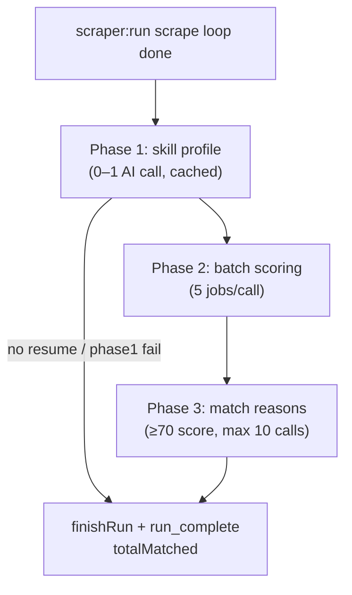

# Design — ai-matching

## Scope

This feature implements the **three-phase AI matching pipeline** in the main
process and wires it to run automatically at the end of a successful
`scraper:run`. It populates `resume.skill_profile`, `jobs.score`,
`jobs.match_reason`, and `runs.total_matched`.

**In scope:** backend abstraction (Ollama + Anthropic), settings reads with
defaults, Phase 1–3 orchestration, DB helpers, progress events, integration hook
in `runScraper`, tests with mocked HTTP.

**Out of scope:** Settings screen UI (`settings-screen`), `ollama:list` IPC
implementation (settings UI uses it later), Results/Scout screen UI, manual
re-score of jobs from prior runs, streaming responses.

Depends on `scraping-engine` (`runId`, new jobs with `score`/`match_reason`
NULL) and `resume-upload` (`resume.raw_text`, `skill_profile` invalidation on
upload).

## Pipeline overview



Constants (exported for tests):

```ts
export const BATCH_SIZE = 5;
export const MATCH_REASON_THRESHOLD = 70;
export const MAX_MATCH_REASON_CALLS = 10;
export const DEFAULT_OLLAMA_BASE_URL = "http://localhost:11434";
export const DEFAULT_OLLAMA_MODEL = "llama3.2";
export const DEFAULT_ANTHROPIC_MODEL = "claude-3-5-haiku-20241022";
```

## Files created or modified

| File | Action | Purpose |
|------|--------|---------|
| `src/main/matcher/types.ts` | Create | Config, job rows, result types, errors |
| `src/main/matcher/settings.ts` | Create | Read `settings` keys with defaults |
| `src/main/matcher/backends/types.ts` | Create | `AiBackend` interface |
| `src/main/matcher/backends/ollama.ts` | Create | Ollama `/api/chat` client |
| `src/main/matcher/backends/anthropic.ts` | Create | Anthropic Messages API client |
| `src/main/matcher/backends/factory.ts` | Create | `createAiBackend()` from settings |
| `src/main/matcher/prompts.ts` | Create | Phase 1–3 prompt builders + JSON schemas |
| `src/main/matcher/parse.ts` | Create | Parse/clamp batch scores; validate profile text |
| `src/main/matcher/matcher-db.ts` | Create | Resume load, job queries, score/reason updates |
| `src/main/matcher/phases/skill-profile.ts` | Create | Phase 1 |
| `src/main/matcher/phases/batch-score.ts` | Create | Phase 2 |
| `src/main/matcher/phases/match-reason.ts` | Create | Phase 3 |
| `src/main/matcher/run.ts` | Create | `runMatching(runId, emit)` orchestrator |
| `src/main/scraper/jobs-db.ts` | Modify | `finishRun` accepts `totalMatched` |
| `src/main/scraper/run.ts` | Modify | Call `runMatching` before final `finishRun` |
| `src/main/scraper/types.ts` | Modify | Extend `ProgressEvent`, `ScraperRunResult` |
| `src/main/index.ts` | Modify | Load `dotenv` at startup (if not already) |
| `docs/architecture.md` | Modify | Document matching integration + settings keys |
| `tests/main/matcher/settings.test.ts` | Create | Default + stored settings |
| `tests/main/matcher/parse.test.ts` | Create | Score JSON parse, clamp 0–100 |
| `tests/main/matcher/matcher-db.test.ts` | Create | DB helpers with `:memory:` |
| `tests/main/matcher/phases/skill-profile.test.ts` | Create | Cache hit/miss, persist |
| `tests/main/matcher/phases/batch-score.test.ts` | Create | Batching, parse failure → 0 |
| `tests/main/matcher/phases/match-reason.test.ts` | Create | Threshold, cap 10, ordering |
| `tests/main/matcher/run.test.ts` | Create | End-to-end with mock backend |
| `tests/main/matcher/backends/ollama.test.ts` | Create | Request shape (mock fetch) |
| `tests/main/matcher/backends/anthropic.test.ts` | Create | Request shape (mock fetch) |
| `tests/main/scraper/run.test.ts` | Modify | Assert matching hook invoked |
| `package.json` | Modify | Add matcher tests to `test` / `test:main` scripts |

No renderer files. `ResumeScreen` already displays `skill_profile` when set
(resume-upload R13–R14).

## Integration with scraper

In `src/main/scraper/run.ts`, after the board loop succeeds and **before**
`finishRun`:

1. Call `runMatching(runId, emit)`.
2. Receive `{ totalMatched, skipped: boolean, skipReason?: string }`.
3. Pass `totalMatched` into `finishRun(runId, { totalScraped, totalNew, totalMatched })`.
4. Include `totalMatched` in `run_complete` event and return value.

Early-exit paths (no boards/keywords) skip matching — no jobs, no resume work.

On scrape fatal error (`catch` block), matching is not invoked.

## Settings keys

Read synchronously from `settings` via `matcher-db.ts` / `settings.ts`:

| Key | Default | Used when |
|-----|---------|-----------|
| `ai.backend` | `"ollama"` | Backend selection |
| `ollama.base_url` | `http://localhost:11434` | Ollama client base URL |
| `ollama.model` | `llama3.2` | Ollama model name |

Anthropic model is fixed in code (`DEFAULT_ANTHROPIC_MODEL`) until
`settings-screen` adds a key. API key comes from `process.env.ANTHROPIC_API_KEY`
after `dotenv.config()` in main entry.

## AI backend interface

```ts
export interface AiBackend {
  readonly name: "ollama" | "anthropic";
  complete(systemPrompt: string, userPrompt: string): Promise<string>;
}

export class AiBackendError extends Error {
  constructor(message: string, readonly cause?: unknown) {
    super(message);
    this.name = "AiBackendError";
  }
}

export function createAiBackend(config: AiConfig): AiBackend;
```

### Ollama (`backends/ollama.ts`)

- `POST {baseUrl}/api/chat`
- Body: `{ model, messages: [{ role: "system", content }, { role: "user", content }], stream: false, format: "json" }` for Phase 2 only; Phases 1 and 3 omit `format`.
- Response: `message.content` string.
- Timeout: 120s per call (`AbortSignal.timeout`).

### Anthropic (`backends/anthropic.ts`)

- `POST https://api.anthropic.com/v1/messages`
- Headers: `x-api-key`, `anthropic-version: 2023-06-01`, `content-type: application/json`
- Body: `{ model, max_tokens: 1024, system, messages: [{ role: "user", content }] }`
- Response: first `content[0].text`.
- IF `ANTHROPIC_API_KEY` missing when backend is anthropic → throw `AiBackendError` before HTTP.

Both backends use global `fetch` (Node 18+). No new npm dependency.

`createAiBackend` accepts injectable `fetchFn` for tests.

## Prompts (`prompts.ts`)

### Phase 1 — skill profile

System: expert résumé analyst. User: full `raw_text` (truncate to 12_000 chars
if longer, suffix `…`).

Expected: plain-text bullet list of skills, seniority, domains, tools (no JSON).

### Phase 2 — batch scoring

System: job-fit scorer. User: JSON payload:

```json
{
  "skillProfile": "<cached profile>",
  "jobs": [
    { "id": 1, "title": "...", "company": "...", "location": "...", "description": "..." }
  ]
}
```

Expected response (JSON only):

```json
{ "scores": [ { "id": 1, "score": 82 } ] }
```

`parse.ts` maps ids → scores, clamps to 0–100 integers, fills missing ids with 0.

### Phase 3 — match reason

System: career coach explaining fit. User: skill profile + single job fields.

Expected: 2–4 sentence plain-text reason (no JSON).

## Database helpers (`matcher-db.ts`)

```ts
export interface ResumeRow {
  id: number;
  raw_text: string;
  skill_profile: string | null;
}

export interface JobForScoring {
  id: number;
  title: string;
  company: string | null;
  location: string | null;
  description: string | null;
}

export function loadResume(): ResumeRow | null;
export function saveSkillProfile(text: string): void;
export function loadUnscoredJobs(runId: number): JobForScoring[];
export function updateJobScore(jobId: number, score: number): void;
export function loadJobsForMatchReason(runId: number, limit: number): JobForScoring[];
export function updateJobMatchReason(jobId: number, reason: string): void;
export function countMatchedJobs(runId: number, threshold: number): number;
```

`saveSkillProfile` updates the latest resume row:
`UPDATE resume SET skill_profile = ? WHERE id = ?`.

`loadJobsForMatchReason` SQL:

```sql
SELECT id, title, company, location, description
FROM jobs
WHERE run_id = ? AND score >= ?
ORDER BY score DESC, id ASC
LIMIT ?
```

Phase 3 passes `limit = MAX_MATCH_REASON_CALLS`.

## Phase modules

### `phases/skill-profile.ts`

```ts
export async function runSkillProfilePhase(
  backend: AiBackend,
  emit: ProgressEmitter
): Promise<{ profile: string } | { error: string }>;
```

Emits `matching_phase` `{ phase: 1, status: "start" | "cached" | "complete" | "error" }`.

### `phases/batch-score.ts`

```ts
export async function runBatchScorePhase(
  backend: AiBackend,
  runId: number,
  skillProfile: string,
  emit: ProgressEmitter
): Promise<{ scored: number }>;
```

Chunks with `chunk(jobs, BATCH_SIZE)`. Emits `matching_phase` phase 2 + optional
`matching_batch` `{ batch, totalBatches, scored }`.

### `phases/match-reason.ts`

```ts
export async function runMatchReasonPhase(
  backend: AiBackend,
  runId: number,
  skillProfile: string,
  emit: ProgressEmitter
): Promise<{ reasonsGenerated: number }>;
```

Emits `matching_phase` phase 3 per job attempted.

## Orchestrator (`matcher/run.ts`)

```ts
export interface MatchingResult {
  totalMatched: number;
  skipped: boolean;
  skipReason?: string;
}

export async function runMatching(
  runId: number,
  emit: ProgressEmitter,
  deps?: { backendFactory?: typeof createAiBackend; fetchFn?: typeof fetch }
): Promise<MatchingResult>;
```

Flow:

1. Emit `matching_start` `{ runId }`.
2. Phase 1 → on failure/skip return `{ totalMatched: 0, skipped: true, skipReason }`.
3. Phase 2 (even if zero unscored jobs — no-op).
4. Phase 3 (even if zero eligible jobs — no-op).
5. `totalMatched = countMatchedJobs(runId, MATCH_REASON_THRESHOLD)`.
6. Emit `matching_complete` `{ runId, totalMatched }`.
7. Return result.

## Progress events

Extend `ProgressEvent` in `src/main/scraper/types.ts`:

| `type` | Fields | When |
|--------|--------|------|
| `matching_start` | `runId` | Matching begins |
| `matching_phase` | `phase: 1 \| 2 \| 3`, `status: string`, optional `detail` | Phase lifecycle |
| `matching_batch` | `batch`, `totalBatches`, `jobCount` | Each Phase 2 batch |
| `matching_complete` | `runId`, `totalMatched` | Matching ends |
| `log` | existing | Skip reasons, backend errors (R4, R7, R11, R15, R22, R23) |

Also extend `run_complete` and `ScraperRunResult` success branch with
`totalMatched: number`.

## Scraper DB change

```ts
export function finishRun(
  runId: number,
  totals: { totalScraped: number; totalNew: number; totalMatched: number }
): void;
```

SQL adds `total_matched = ?` to the existing `UPDATE runs`.

## Discarded alternative: separate `matcher:run` IPC channel

Expose matching as its own invoke channel the Scout screen calls after scraping.

**Discarded because:**

1. ROADMAP defines matching as part of "each scout session" — one atomic flow.
2. A separate channel would require the renderer to orchestrate ordering and
   handle partial failures between scrape and match.
3. Hooking `runScraper` keeps `scout-screen` thin (single Run button).

## Discarded alternative: score all jobs in one AI call

Send the entire job list in a single prompt instead of batches of five.

**Discarded because:**

1. ROADMAP explicitly specifies five jobs per call.
2. Large result sets exceed context limits and degrade JSON reliability.
3. Batching enables incremental progress events and partial success.

## Discarded alternative: `@anthropic-ai/sdk` dependency

Use the official Anthropic SDK for Messages API.

**Discarded because:**

1. `docs/architecture.md` — minimal dependencies; Ollama already uses raw HTTP.
2. A thin `fetch` wrapper keeps both backends symmetric and easy to mock in tests.
3. Messages API surface used here is stable and small.

## Test strategy

| Test file | Covers |
|-----------|--------|
| `settings.test.ts` | R18, R20 — defaults when keys missing |
| `parse.test.ts` | R10, R11 — clamp, malformed JSON → zeros |
| `matcher-db.test.ts` | R8, R12, R14, R16 — queries and updates |
| `skill-profile.test.ts` | R5, R6, R7 — cache hit, generate+persist, empty response |
| `batch-score.test.ts` | R9, R10, R11, R23 — chunk sizes 1–5, persist scores |
| `match-reason.test.ts` | R12, R13, R14, R15 — ordering, cap 10, skip failures |
| `run.test.ts` | R1–R4, R16, R17, R22 — orchestration, skip paths |
| `ollama.test.ts` / `anthropic.test.ts` | R18–R21 — URL, headers, error mapping |
| `run.test.ts` (scraper) | R1, R17 — matching invoked on successful scrape |

Mock pattern: inject `fetchFn` returning canned JSON/text; use `:memory:` SQLite
with migrations applied (same pattern as `jobs-db.test.ts`).
